# AI Radiology Analyzer

[](https://github.com/cherniamine/AI-Radiology-Analyzer/actions/workflows/ci.yml)
[](https://ai-radiology-analyzer-mdruw7j6zcr8kpjldg33cp.streamlit.app)


[](LICENSE)

Classification de radiographies pulmonaires (COVID-19, opacité pulmonaire, pneumonie virale, normal) par réseau de neurones convolutif, avec cartes d'attention Grad-CAM et interface Streamlit interactive.

👉 **[Tester la démo en ligne](https://ai-radiology-analyzer-mdruw7j6zcr8kpjldg33cp.streamlit.app)** — aucune installation requise.

> **Avertissement.** Ce projet est un prototype académique à but pédagogique. Il ne fournit aucune valeur diagnostique et ne doit en aucun cas remplacer l'avis d'un radiologue ou d'un médecin.

---

## Sommaire

- [Aperçu](#aperçu)
- [Démo en ligne](#démo-en-ligne)
- [Captures d'écran](#captures-décran)
- [Pipeline](#pipeline)
- [Résultats](#résultats)
- [Architecture du modèle](#architecture-du-modèle)
- [Rapport généré automatiquement](#rapport-généré-automatiquement)
- [Assistant IA](#assistant-ia)
- [Jeu de données](#jeu-de-données)
- [Structure du projet](#structure-du-projet)
- [Configuration](#configuration)
- [Installation](#installation)
- [Utilisation](#utilisation)
- [Tests et intégration continue](#tests-et-intégration-continue)
- [Accessibilité](#accessibilité)
- [Limites connues](#limites-connues)
- [Pistes d'amélioration](#pistes-damélioration)
- [Auteur](#auteur)

---

## Aperçu

Le projet couvre l'ensemble du pipeline de classification d'images médicales :

- **Validation des entrées** : rejet des fichiers non exploitables (résolution insuffisante, image quasi uniforme, image couleur non compatible avec une radiographie) avant l'inférence
- **Prétraitement** des radiographies (redimensionnement, normalisation, augmentation de données)
- **Entraînement** d'un CNN sur quatre classes de pathologies pulmonaires
- **Évaluation** quantitative (précision, rappel, F1-score, matrice de confusion)
- **Explicabilité** via Grad-CAM : vue comparative côte à côte (original / heatmap / fusion), transparence ajustable par image, export PNG individuel de chaque vue
- **Rapport structuré par gabarit** (`app/report_generator.py`) : observations, impression et recommandation adaptées à la classe prédite, exportable en PDF (original + Grad-CAM + fusion + rapport) et en JSON
- **Interface applicative** (Streamlit) permettant de déposer des radiographies et d'obtenir un rapport exportable (CSV, PDF, JSON) et des visualisations (ZIP)

## Démo en ligne

L'application est déployée publiquement et testable directement dans le navigateur, sans installation :

👉 **https://ai-radiology-analyzer-mdruw7j6zcr8kpjldg33cp.streamlit.app**

**Disponible dans la démo publique :**
- ✅ Analyse de radiographies thoraciques (4 classes)
- ✅ Explicabilité Grad-CAM
- ✅ Interface multilingue (français, anglais, arabe)
- ✅ Génération de rapports (PDF & JSON)
- ✅ Historique des analyses
- ✅ Paramètres modifiables

**Non disponible dans cette démo :**
- ⚠️ **Assistant IA** — nécessite un serveur Ollama local ; désactivé sur le déploiement hébergé.

## Captures d'écran

Navigation multi-pages complète (Dashboard, Analyse, Rapports, Historique, Assistant IA, Paramètres, À propos), identité visuelle "négatoscope" (palette ambre, conforme WCAG AA — voir [Accessibilité](#accessibilité)), disponible en français, anglais et arabe (support RTL réel), en thème clair et sombre.

### 📊 Dashboard

KPI et graphiques calculés depuis l'historique réel des analyses (répartition par classe, confiance moyenne, temps d'inférence, évolution dans le temps) — jamais de données simulées.

<p align="center">
  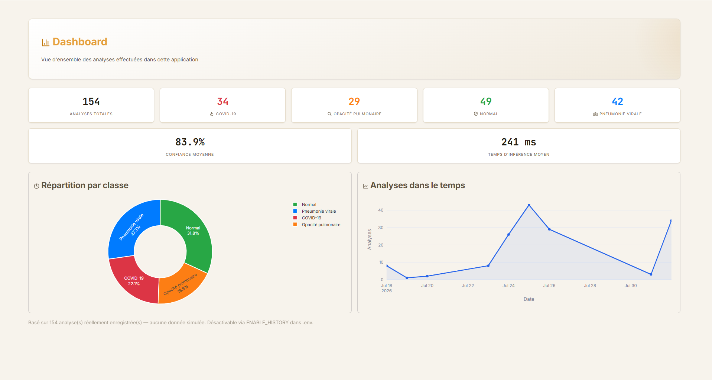
</p>

### 🔬 Nouvelle analyse

Page d'accueil de l'analyse (modèle, résolution, exactitude, mode d'emploi) :

<p align="center">
  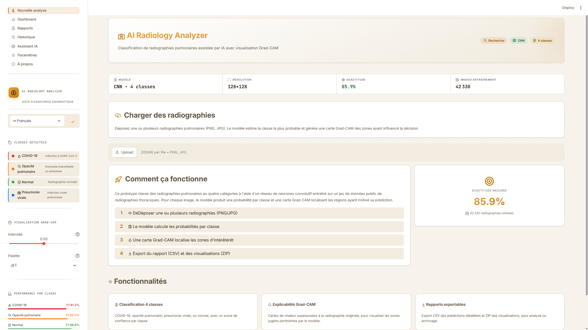
</p>

Dépôt de plusieurs radiographies avec suivi détaillé de chaque étape du pipeline (validation, CNN, Grad-CAM, rapport) :

<p align="center">
  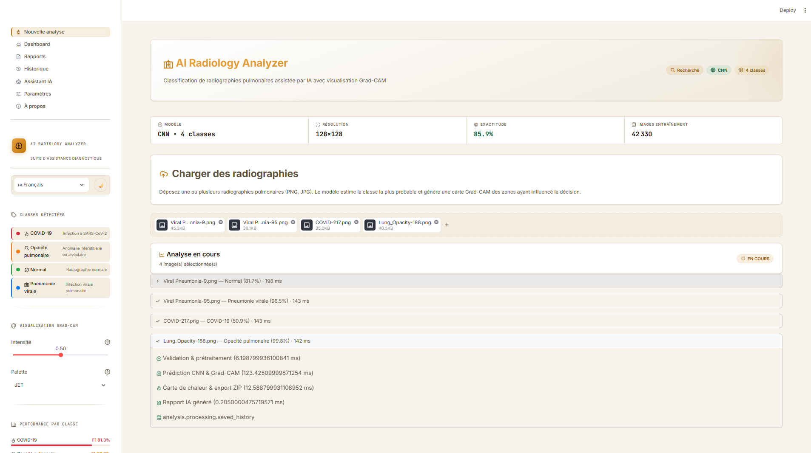
</p>

Résultats agrégés (distribution par classe, distribution des scores de confiance, détail par classe) :

<p align="center">
  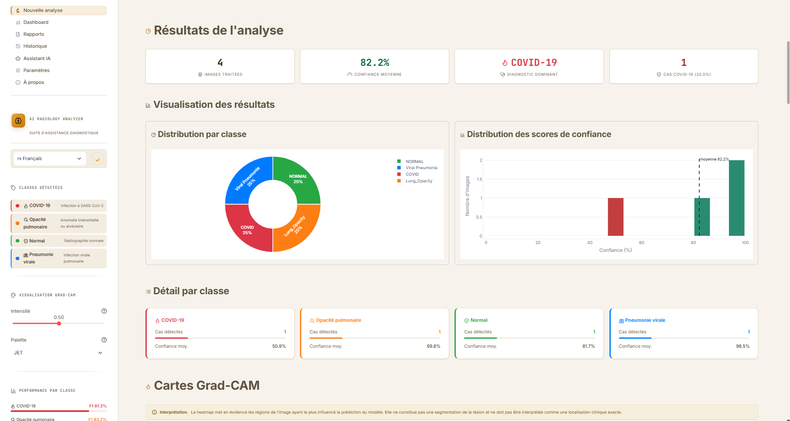
</p>

Détail d'une image analysée : classe prédite, jauge de confiance, probabilités par classe, et rapport IA structuré (observations / impression / recommandation) :

<p align="center">
  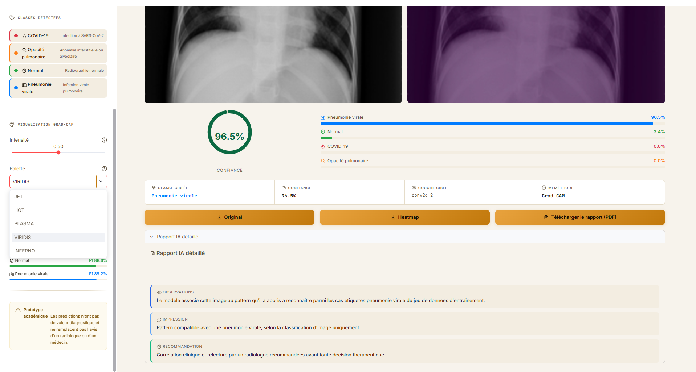
</p>

### 🔥 Cartes Grad-CAM

Comparaison côte à côte (original / heatmap), transparence et colormap ajustables individuellement par image, sans re-inférence.

<p align="center">
  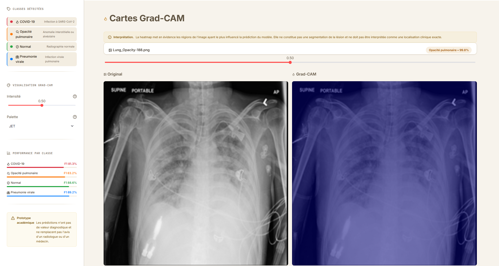
</p>

### 📄 Rapports

Aperçu PDF inline (intégré en base64) et aperçu JSON interactif pour chaque analyse enregistrée.

<p align="center">
  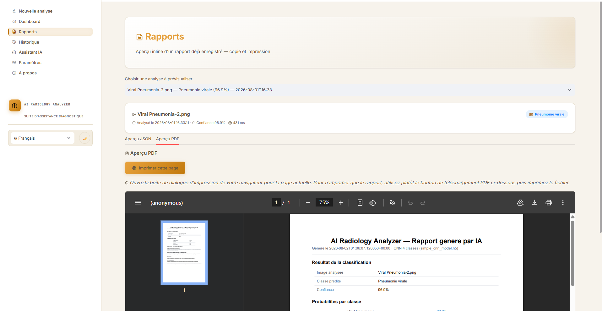
</p>

### 🕓 Historique

Recherche par nom de fichier, filtre par classe, détails et export (JSON/PDF) ou suppression d'une analyse passée.

<p align="center">
  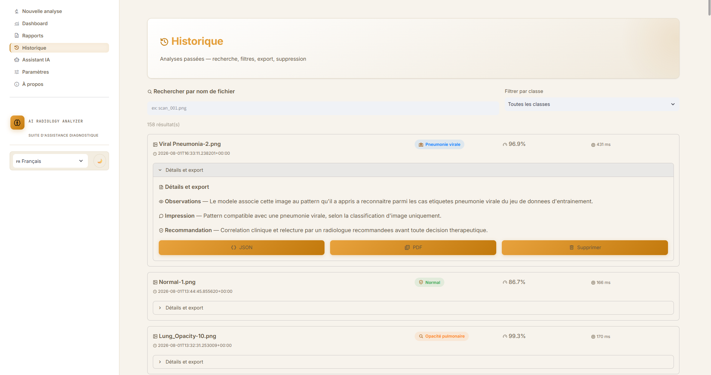
</p>

### 🤖 Assistant IA

Chat RAG local (garde-fou médical, recherche documentaire, génération via Ollama), avec sources citées pour chaque réponse.

<p align="center">
  
</p>

### ⚙️ Paramètres et 🌍 internationalisation

9 réglages modifiables en direct (opacité Grad-CAM, taille max. d'upload, interrupteurs de fonctionnalités, fournisseur/modèle Ollama), disponibles dans les 3 langues supportées — y compris en arabe avec mise en page RTL complète :

| Français | English | العربية (RTL) |
|:---:|:---:|:---:|
| 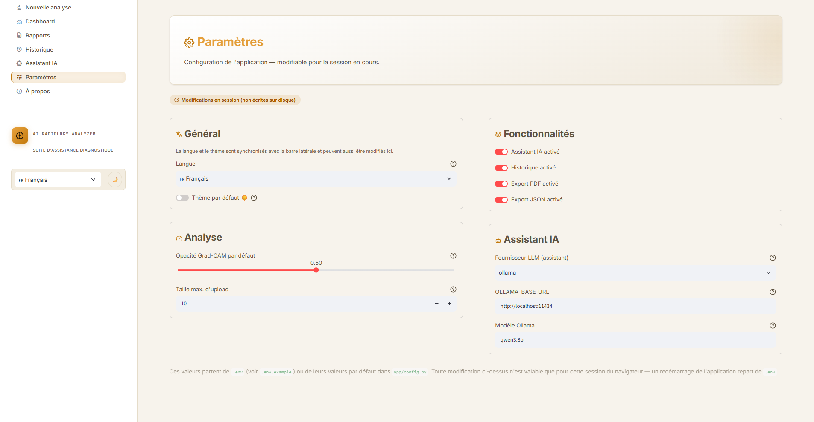 | 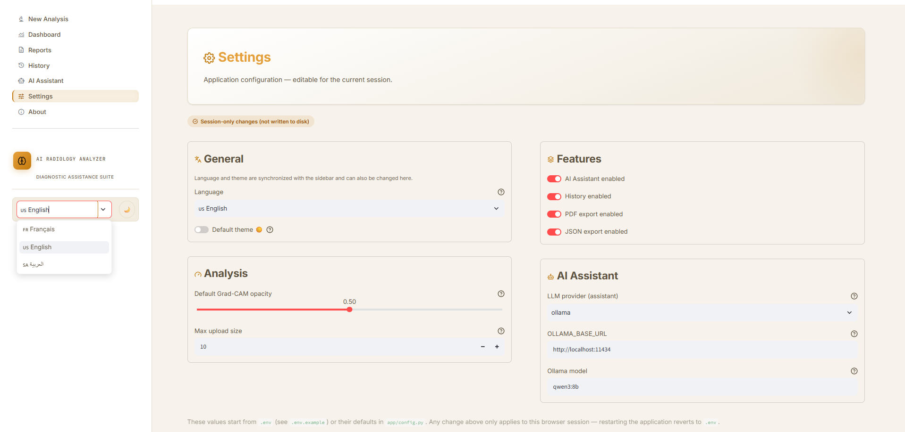 | 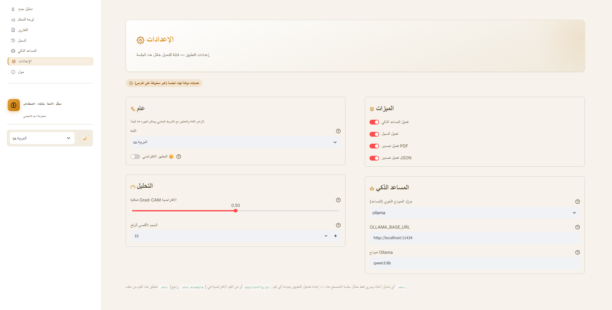 |

### ℹ️ À propos

Contenu réel (architecture, technologies, limites connues, feuille de route), en thème clair et sombre :

| Thème clair | Thème sombre |
|:---:|:---:|
| 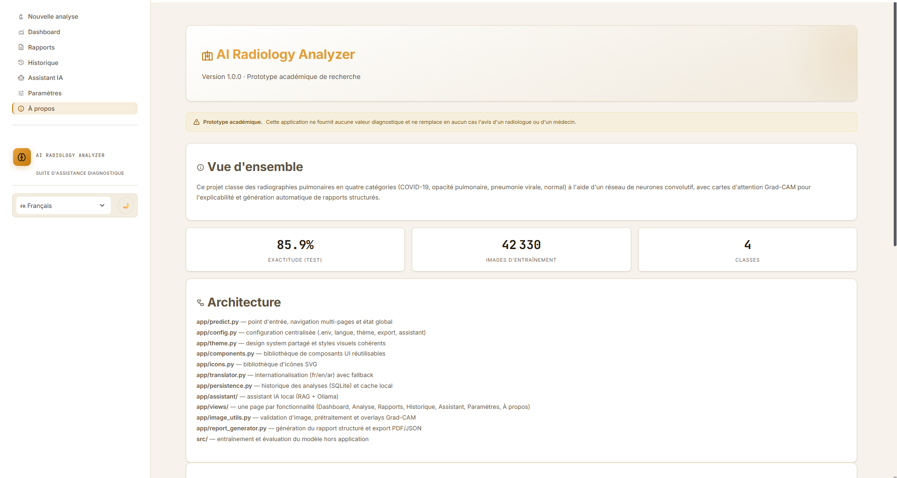 | 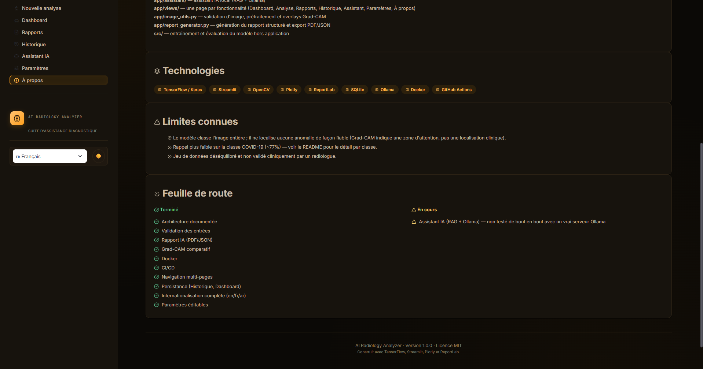 |

---

## Pipeline

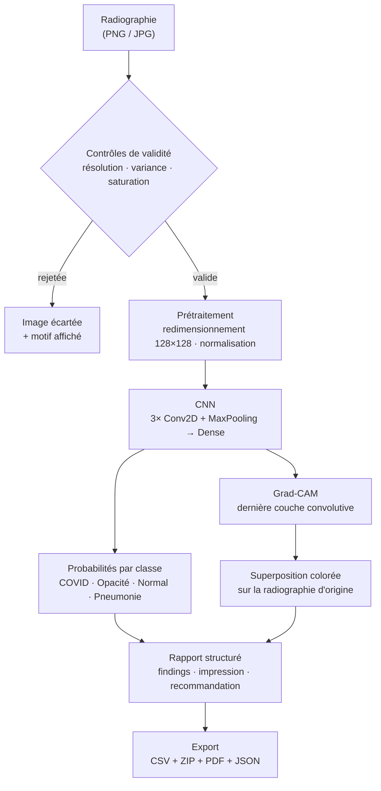

L'étape de validation (`validate_xray_image` dans `app/predict.py`) est une heuristique, pas un classifieur : elle écarte les cas évidents avant l'inférence — résolution trop faible, image quasi uniforme (capture vide, fichier corrompu), ou saturation colorimétrique trop élevée pour une radiographie (qui est intrinsèquement en niveaux de gris). Elle a été validée sur 120 images réelles du jeu de données (0 faux rejet) et sur des cas synthétiques (photo couleur, image vide, image trop petite — tous correctement écartés).

## Résultats

Mesures obtenues sur le jeu de test (`results/metrics.json`), à jour au dernier entraînement disponible dans ce dépôt :

**Exactitude globale : 85.9 %**

| Classe            | Précision | Rappel | F1-score | Échantillons (test) |
|-------------------|:---------:|:------:|:--------:|:--------------------:|
| COVID-19           | 85.6 %    | 77.5 % | 81.3 %   | 1 446 |
| Opacité pulmonaire | 80.3 %    | 86.4 % | 83.2 %   | 2 404 |
| Normal             | 89.0 %    | 88.1 % | 88.6 %   | 4 076 |
| Pneumonie virale   | 90.0 %    | 88.5 % | 89.2 %   | 538 |

La matrice de confusion et les courbes d'entraînement complètes sont disponibles dans `results/confusion_matrix.png` et `results/curves/`.

Le rappel plus faible sur la classe COVID-19 (77.5 %) est le point le plus sensible du modèle dans un contexte clinique — voir [Limites connues](#limites-connues).

## Architecture du modèle

Le dépôt contient deux définitions de modèle :

- **`models/simple_cnn_model.h5`** — le modèle effectivement utilisé par l'application (`app/predict.py`) et évalué ci-dessus. Il s'agit d'un CNN simple : 3 blocs `Conv2D` + `MaxPooling2D`, suivis d'un `Flatten`, d'un `Dropout` et de deux couches `Dense` (128×128×3 en entrée, 4 classes en sortie).
- **`src/model.py`** — une architecture alternative basée sur **EfficientNetB0** (transfer learning, poids ImageNet gelés, tête de classification dédiée), prévue pour une itération future mais non utilisée par le modèle livré.

L'explicabilité est assurée par **Grad-CAM**, calculé sur la dernière couche convolutive du modèle (`conv2d_2`). Pour chaque image, l'interface affiche l'image originale, la heatmap seule et la fusion des deux côte à côte, avec une transparence ajustable individuellement par image (sans re-inférence : la heatmap brute est conservée et recomposée à la volée) et un choix de colormap (JET, HOT, PLASMA, VIRIDIS, INFERNO). Chacune des trois vues est téléchargeable séparément en PNG.

> La heatmap Grad-CAM indique une zone d'attention du réseau, pas une segmentation de lésion ni une localisation anatomique validée — voir la section [Rapport généré automatiquement](#rapport-généré-automatiquement).

## Rapport généré automatiquement

Chaque image analysée produit un rapport structuré (`app/report_generator.py`) avec quatre sections : observations, impression, recommandation, et un avertissement systématique. Il est exportable individuellement en **PDF** (radiographie originale + carte Grad-CAM + rapport) depuis chaque carte de résultat, et collectivement en **JSON** pour l'ensemble des images traitées.

**Ce que ce rapport est** : un gabarit texte fixe par classe (COVID-19, opacité pulmonaire, normal, pneumonie virale), où seules les valeurs numériques (confiance, probabilités) varient d'une image à l'autre.

**Ce que ce rapport n'est pas** : un compte-rendu radiologique. Le modèle ne fait que de la classification d'image entière — il ne localise aucune anomalie de façon fiable (pas de lobe, pas de mesure). Le texte généré reste donc volontairement générique et ne mentionne jamais de localisation anatomique précise que le modèle n'a pas réellement déterminée. Le disclaimer fait partie intégrante du texte, du PDF et du JSON, et n'est jamais retiré.

## Assistant IA

Un assistant conversationnel (page **🤖 Assistant IA**) répond aux questions sur le projet — le modèle, Grad-CAM, la confiance, les limites, Docker, l'utilisation de l'application — à partir de sa documentation. Architecture RAG hybride, entièrement locale :

1. **Garde-fou médical** (`app/assistant/safety.py`) — s'exécute **avant tout appel au LLM**. Détecte (par motifs, en français/anglais/arabe) les demandes de diagnostic, traitement, prescription ou avis médical personnel, et refuse poliment sans jamais contacter le modèle de langage. Défense en profondeur : le prompt système impose aussi ce refus au LLM, au cas où.
2. **Recherche** (`app/assistant/retriever.py`) — recherche par similarité TF-IDF dans `app/assistant/knowledge_base/` (8 documents), sans dépendance à Ollama ni appel réseau.
3. **Génération** (`app/assistant/providers/ollama_provider.py`) — le contexte trouvé est injecté dans un prompt envoyé à **Ollama, en local**, aucune API payante. Fournisseur configurable via `.env` (`LLM_PROVIDER`, `OLLAMA_BASE_URL`, `OLLAMA_MODEL`) ; l'abstraction `providers/` permet d'ajouter un autre fournisseur (OpenAI, Gemini, Claude...) sans toucher à l'interface ni à l'orchestration RAG.

La langue de réponse suit automatiquement la langue sélectionnée dans l'interface (fr/en/ar).

**Pour l'utiliser** : installez [Ollama](https://ollama.com), lancez `ollama serve`, puis `ollama pull qwen3:8b` (ou le modèle configuré dans `.env`). Sans cela, l'assistant affiche un message d'erreur clair plutôt qu'un plantage.

> **Point d'attention non testé.** Je n'ai pas eu accès à un serveur Ollama dans mon environnement de développement : la construction de la requête HTTP, le parsing de la réponse et la dégradation propre en cas d'indisponibilité sont testés (avec un serveur simulé et avec la vraie absence d'Ollama), mais la qualité réelle des réponses générées par le modèle `qwen3:8b` n'a pas pu être vérifiée. À valider de votre côté avec un Ollama réellement lancé.

## Jeu de données

Radiographies thoraciques réparties en 4 classes, pour un total de **42 330 images** :

| Classe             | Images |
|--------------------|-------:|
| Normal             | 20 384 |
| Opacité pulmonaire | 12 024 |
| COVID-19           |  7 232 |
| Pneumonie virale   |  2 690 |

Le jeu de données est **déséquilibré** (la classe *Normal* représente près de la moitié des images, la *Pneumonie virale* moins de 7 %), ce qui explique en partie l'écart de performance entre classes observé plus haut.

Répartition entraînement / validation / test gérée par `src/preprocessing.py` (80/20 avec `ImageDataGenerator`, augmentation par rotation, zoom et retournement horizontal sur l'ensemble d'entraînement uniquement).

## Structure du projet

```
AI-Radiology-Analyzer/
├── .github/
│   └── workflows/
│       └── ci.yml              # Syntaxe + tests unitaires a chaque push/PR
├── app/
│   ├── predict.py              # Point d'entrée : navigation multi-pages (st.navigation), une seule fois le theme + page config
│   ├── config.py                # Configuration centralisée, chargée depuis .env (voir .env.example)
│   ├── theme.py                  # Design system partagé (CSS injecté une fois par predict.py)
│   ├── views/                     # Une page = un module avec une fonction render()
│   │   ├── analysis.py            # 🔬 Nouvelle analyse — fonctionnalité complète (upload, Grad-CAM, rapport, export)
│   │   ├── dashboard.py           # 📊 Dashboard — KPI et graphiques réels (persistance)
│   │   ├── reports.py             # 📄 Rapports — aperçu JSON interactif + copiable, aperçu PDF inline, impression navigateur
│   │   ├── history.py             # 🕓 Historique — recherche, filtres, suppression, ré-export (persistance)
│   │   ├── assistant.py           # 🤖 Assistant IA — chat RAG + Ollama (voir app/assistant/)
│   │   ├── settings.py            # ⚙️ Paramètres — configuration de session, synchronisée avec la langue/theme de la sidebar
│   │   └── about.py                # ℹ️ À propos — contenu réel, ne dépend d'aucune autre phase
│   ├── assistant/                  # Assistant IA : RAG hybride (recherche locale + génération Ollama)
│   │   ├── assistant.py             # API publique (ask()), utilisée par views/assistant.py
│   │   ├── rag.py                    # Orchestration : sécurité → retrieval → prompts → génération
│   │   ├── retriever.py               # Recherche TF-IDF sur knowledge_base/ — sans dépendance à Ollama
│   │   ├── safety.py                   # Détection de demande de diagnostic/traitement — s'exécute AVANT le LLM
│   │   ├── prompts.py                   # Prompt système, prompt utilisateur, messages traduits (fr/en/ar)
│   │   ├── providers/                    # Abstraction fournisseur LLM (ajouter un fournisseur sans toucher à l'UI)
│   │   │   ├── base.py                    # Interface LLMProvider + ProviderUnavailableError
│   │   │   └── ollama_provider.py          # Implémentation Ollama (seul fournisseur pour l'instant)
│   │   └── knowledge_base/                # Documentation source de l'assistant (8 fichiers .md)
│   ├── persistence.py           # Historique des analyses (SQLite local) — sans dépendance à TensorFlow/Streamlit
│   ├── components.py            # Bibliothèque de composants UI réutilisables (SectionTitle, MetricCard, ConfidenceGauge...)
│   ├── translator.py            # i18n (fr/en/ar), repli honnête sur clé manquante, RTL
│   ├── locales/
│   │   ├── fr.json               # Traductions françaises (langue source, la plus complète)
│   │   ├── en.json                # Traductions anglaises
│   │   └── ar.json                 # Traductions arabes
│   ├── image_utils.py           # Validation d'image, prétraitement, Grad-CAM (post-traitement) — sans TensorFlow
│   └── report_generator.py     # Génération du rapport structuré + export PDF/JSON
├── src/
│   ├── preprocessing.py        # Générateurs de données (train/val/test)
│   ├── model.py                 # Définition du modèle (EfficientNetB0)
│   ├── train.py                 # Boucle d'entraînement
│   └── evaluate.py              # Évaluation (rapport de classification, matrice de confusion)
├── tests/
│   ├── test_image_utils.py     # Validation d'image, colorisation/fusion Grad-CAM
│   ├── test_report_generator.py # Rapport texte, validité JSON, création PDF
│   ├── test_persistence.py     # Historique SQLite : sauvegarde, recherche, filtres, suppression, statistiques
│   ├── test_translator.py       # i18n : traduction, repli sur clé manquante, changement de langue, RTL
│   ├── test_components.py       # Composants UI : HTML généré, seuils de couleur, tri des barres de probabilité
│   ├── test_accessibility_contrast.py # Ratios de contraste WCAG AA réels, clair et sombre
│   ├── test_assistant_retriever.py # Recherche TF-IDF sur la base de connaissances
│   ├── test_assistant_safety.py    # Détection des demandes de diagnostic/traitement (fr/en/ar)
│   └── test_assistant_rag.py        # Orchestration RAG, prompts, fournisseur Ollama (mocké)
├── tests_integration/            # Suite complète (AppTest, nécessite TensorFlow — voir Tests)
│   └── test_predict_apptest.py   # Navigation, upload réel, pipeline, i18n, thème, assistant, PDF/JSON
├── notebooks/
│   ├── 01_exploration.ipynb
│   ├── 02_preprocessing.ipynb
│   ├── 03_model_training.ipynb
│   └── 04_evaluation_gradcam.ipynb
├── models/
│   └── simple_cnn_model.h5     # Modèle entraîné utilisé par l'application
├── results/
│   ├── metrics.json            # Métriques d'évaluation par classe
│   ├── model_info.json         # Détail de l'architecture du modèle livré
│   ├── confusion_matrix.png
│   └── curves/                  # Courbes d'entraînement
├── data/                        # Images sources, organisées par classe
├── Dockerfile
├── docker-compose.yml
├── .dockerignore
├── .env.example                  # Modèle de configuration (copier en .env, jamais versionné)
├── LICENSE
├── requirements.txt
└── requirements-dev.txt         # Dépendances légères pour les tests / la CI
```

> Le fichier `05 Evaluation Gradcam.ipynb` semble être une copie de travail de `04_evaluation_gradcam.ipynb` ; à vérifier et supprimer si redondant.

## Configuration

L'application se configure via des variables d'environnement (voir `.env.example` à la racine) plutôt que par des valeurs codées en dur :

```bash
cp .env.example .env
# puis ajuster .env selon votre environnement
```

Variables disponibles : chemins des artefacts (`MODEL_PATH`, `METRICS_PATH`, `REPORT_OUTPUT`), identité de l'application (`APP_TITLE`, `APP_VERSION`, `DEFAULT_LANGUAGE`, `DEFAULT_THEME`, `DEFAULT_GRADCAM_ALPHA`, `MAX_UPLOAD_SIZE_MB`), interrupteurs de fonctionnalités (`ENABLE_ASSISTANT`, `ENABLE_HISTORY`, `ENABLE_PDF_EXPORT`, `ENABLE_JSON_EXPORT`), et la configuration de l'assistant IA à venir (`LLM_PROVIDER`, `OLLAMA_BASE_URL`, `OLLAMA_MODEL` — voir Roadmap). La page **Paramètres** de l'application affiche la configuration réellement chargée.

## Installation

### Avec Docker (recommandé)

Prérequis : [Docker](https://docs.docker.com/get-docker/) et Docker Compose.

```bash
git clone https://github.com/cherniamine/AI-Radiology-Analyzer.git
cd AI-Radiology-Analyzer
docker compose up --build
```

L'application est disponible sur `http://localhost:8501`. L'image ne contient que le code de l'application, le modèle entraîné (`models/simple_cnn_model.h5`) et les métriques d'évaluation (`results/metrics.json`) — le dossier `data/` (~900 Mo) n'est pas requis à l'exécution et n'est jamais copié dans l'image (voir `.dockerignore`).

### Sans Docker

Prérequis : Python 3.9+.

```bash
git clone https://github.com/cherniamine/AI-Radiology-Analyzer.git
cd AI-Radiology-Analyzer
python -m venv venv
source venv/bin/activate        # Windows : venv\Scripts\activate
pip install -r requirements.txt
```

### Streamlit Community Cloud

Pour le déploiement sur Streamlit Community Cloud, le dépôt inclut désormais :

- un `runtime.txt` qui force un runtime Python compatible avec TensorFlow (`python-3.11`)
- une version CPU de TensorFlow et `opencv-python-headless` dans `requirements.txt`
- une config `.streamlit/config.toml` en mode headless pour le service Streamlit

Cela évite l'erreur `No matching distribution found for tensorflow>=2.10.0` causée par l'environnement Python 3.14 de Community Cloud.

## Utilisation

**Lancer l'application** (si vous n'utilisez pas Docker) :

```bash
streamlit run app/predict.py
```

L'application s'ouvre sur `http://localhost:8501`, avec une navigation multi-pages dans la barre latérale (Dashboard, Analyse, Rapports, Historique, Assistant IA, Paramètres, À propos). La page **Nouvelle analyse** est la seule pleinement fonctionnelle aujourd'hui : déposez une ou plusieurs radiographies (PNG/JPG) pour obtenir, par image, la classe prédite, le score de confiance par classe, la carte Grad-CAM et un rapport structuré, puis exportez le tout (CSV, PDF par image, JSON, ZIP des visualisations). Les autres pages affichent explicitement leur état d'avancement (voir [Pistes d'amélioration](#pistes-damélioration)).

**Ré-entraîner ou évaluer le modèle :**

```bash
python src/train.py       # entraînement (lit data/, écrit models/simple_cnn_model.h5)
python src/evaluate.py    # évaluation sur le jeu de test
```

Les notebooks du dossier `notebooks/` retracent, dans l'ordre, l'exploration des données, le prétraitement, l'entraînement et l'évaluation avec Grad-CAM.

## Tests et intégration continue

### Suite rapide (`tests/`, 283 tests, sans TensorFlow)

Couvre `app/image_utils.py` (validation d'image, prétraitement, colorisation et fusion Grad-CAM), `app/report_generator.py` (génération du rapport texte, validité JSON, création du PDF), `app/persistence.py` (sauvegarde, recherche, filtres, suppression, statistiques), `app/translator.py` (traduction, repli sur clé manquante, changement de langue, RTL), `app/components.py` (HTML généré par chaque composant, seuils de couleur, tri), `app/icons.py` (validité SVG de chaque icône), `app/assistant/` (recherche TF-IDF, détection des demandes médicales en fr/en/ar, orchestration RAG avec fournisseur Ollama mocké) et la conformité de contraste WCAG AA de la palette de couleurs (`test_accessibility_contrast.py`). Aucun de ces modules ne dépend de TensorFlow, ce qui garde la suite rapide (< 3 secondes en local).

```bash
pip install -r requirements-dev.txt
pytest tests/ -v
```

### Suite d'intégration complète (`tests_integration/`, 24 tests, nécessite TensorFlow)

Basée sur `streamlit.testing.v1.AppTest`, l'API de test officielle de Streamlit : elle charge réellement `predict.py` (modèle entraîné inclus), simule de vrais uploads d'images, de vrais clics, de vrais changements de langue/thème, et une vraie conversation avec l'assistant — contrairement à une exécution "à blanc" (`python3 predict.py`) ou à un `curl` sur `/`, qui ne récupère que la coquille HTML/JS statique sans jamais exécuter le script côté serveur.

Cette suite a directement trouvé et permis de corriger deux bugs réels qu'aucune autre méthode de test n'avait détectés (voir détail dans l'historique du projet) :
- **Collision d'URL dans `st.navigation`** : les sept pages exposent chacune une fonction nommée `render`, et Streamlit déduit par défaut le chemin d'URL du nom du callable → collision → l'application plantait à **chaque** chargement. Corrigé en passant un `url_path` explicite à chaque `st.Page()`.
- **`NameError: name 'json' is not defined`** dans la section export de `app/views/analysis.py` (import manquant), qui ne se déclenchait qu'après un vrai upload suivi d'un rendu de la section export — un chemin de code qu'aucun test précédent n'exerçait réellement.

```bash
pip install -r requirements.txt pytest
pytest tests_integration/ -v
```

**Pourquoi cette suite n'est pas dans la CI rapide.** Elle nécessite TensorFlow et le modèle entraîné (chargement ~10-15 s par test), ce qui va à l'encontre de l'objectif de rapidité de la pipeline par push/PR. Elle doit être exécutée localement avant tout changement touchant `predict.py` ou `app/views/analysis.py`.

**Limite connue de `AppTest`** : `AppTest.switch_page()` ne fonctionne pas avec des pages définies par callable (`st.Page(fonction, url_path=...)`, notre architecture) — il ne vérifie que l'existence du fichier passé en argument, pas la correspondance avec la page réellement enregistrée, et échoue donc silencieusement (aucune exception, mais la page ne change pas). Le mécanisme correct, utilisé dans `tests_integration/test_predict_apptest.py` (fonction `goto_page`), consiste à calculer soi-même `streamlit.util.calc_hash(url_path)` et à l'assigner à l'attribut privé `AppTest._page_hash`.

Le workflow GitHub Actions (`.github/workflows/ci.yml`) exécute à chaque `push` et `pull request` sur `main` :

1. Checkout du dépôt
2. Installation de Python 3.10
3. Installation des dépendances légères (`requirements-dev.txt`)
4. Vérification de la syntaxe de tout le projet, y compris `tests_integration/` (`compileall`)
5. Vérification que les modules testables s'importent sans erreur
6. Exécution de la suite rapide `pytest tests/`

## Accessibilité

Un audit de contraste WCAG 2.1 AA a été réalisé — calcul réel des ratios (formule de luminance relative WCAG), pas une estimation visuelle — sur chaque paire texte/fond et icône/fond utilisée dans l'application, en mode clair et sombre. Résultats et corrections :

- **Trouvé en échec** : `--text-muted` (2.56:1 sur fond clair, sous le seuil 4.5:1), les badges succès/avertissement (jusqu'à 1.96:1), le badge info (4.37:1), et plusieurs couleurs de confiance codées en dur et dupliquées dans `analysis.py` (`#FD7E14` à 2.57:1, sous même le seuil graphique 3:1).
- **Corrigé** : `--text-muted` assombri (`#726550` en clair / `#8F8370` en sombre, ≥ 4.5:1 dans les deux modes) ; ajout de variantes `--success-text` / `--warning-text` / `--danger-text` / `--accent-text` dédiées au texte et aux icônes (plus foncées ou plus claires que les tons de marque d'origine, qui restent inchangés pour les usages non textuels) ; les 4 endroits qui recalculaient une couleur de confiance en dur dans `analysis.py` ont été remplacés par un seul appel à `components.confidence_color()`, éliminant la duplication en même temps que le bug de contraste.
- **Testé en permanence** : `tests/test_accessibility_contrast.py` (19 tests) calcule ces ratios à chaque exécution de la suite — toute régression future serait détectée automatiquement, pas seulement lors d'une revue manuelle.

Autres améliorations :
- **Focus clavier** : anneau de focus visible (`:focus-visible`) sur les boutons, liens, champs et éléments de navigation, actif uniquement à la navigation au clavier (pas au clic souris), conformément à WCAG 2.4.7.
- **Info-bulles** : ajout de `help=` sur les actions ambiguës ou destructrices (suppression dans l'Historique, export PDF individuel, curseurs Grad-CAM), en plus de celles déjà présentes.
- **Icônes accompagnées de texte** : aucune icône seule sans libellé adjacent dans l'interface (le bouton clair/sombre, seul cas icône-seule, a un `help=` explicite servant de label accessible).

**Non vérifié** : le rendu réel au lecteur d'écran et la navigation clavier de bout en bout necessitent un navigateur, indisponible dans cet environnement de développement. Les ratios de contraste et la présence des attributs d'accessibilité sont vérifiés programmatiquement ; le comportement réel (ordre de tabulation, annonces de lecteur d'écran) reste à valider manuellement.

## Limites connues


- **Rappel COVID-19 limité (77.5 %)** : dans un cas d'usage réel, ce taux de faux négatifs serait inacceptable sans confirmation par un second examen.
- **Déséquilibre des classes** dans le jeu de données, non compensé par pondération de classe ou sur-échantillonnage.
- **Modèle simple CNN** entraîné from scratch avec peu de régularisation ; l'architecture EfficientNetB0 fournie dans `src/model.py` n'a pas été évaluée dans ce dépôt.
- **Jeu de données non annoté par un radiologue** dans ce projet (dataset public) ; aucune validation clinique n'a été réalisée.
- Le dépôt contient les images sources et les poids du modèle (~900 Mo au total) directement versionnés dans Git plutôt que via Git LFS ou un stockage externe.

## Pistes d'amélioration

Le projet évolue vers une application de type SaaS (navigation multi-pages, historique, tableau de bord, assistant IA, internationalisation). Statut réel, phase par phase :

**Fait**
- ✅ Navigation multi-pages (`st.navigation`) : Dashboard, Analyse, Rapports, Historique, Assistant, Paramètres, À propos, chacune un module indépendant.
- ✅ Configuration centralisée (`app/config.py` + `.env`), plus aucune valeur codée en dur.
- ✅ Design system partagé (`app/theme.py`), injecté une seule fois.
- ✅ Page À propos (contenu réel) et Paramètres (lecture de la configuration réelle).
- ✅ Persistance des analyses (`app/persistence.py`, SQLite local, testé — 19 tests) : chaque analyse effectuée dans **Nouvelle analyse** est enregistrée (image, prédiction, probabilités, rapport, temps d'inférence), désactivable via `ENABLE_HISTORY`.
- ✅ Dashboard avec KPI et graphiques réels (répartition par classe, confiance moyenne, temps d'inférence moyen, évolution dans le temps) — calculés depuis la base, jamais inventés ; état vide honnête tant qu'aucune analyse n'existe.
- ✅ Historique : recherche par nom de fichier, filtre par classe, suppression, ré-export JSON/PDF d'une analyse passée (régénéré depuis les images stockées, sans ré-exécuter le modèle).
- ✅ Infrastructure i18n (`app/translator.py` + `app/locales/{fr,en,ar}.json`, testée — 19 tests) : sélecteur de langue global dans la barre latérale et dans Paramètres, langue persistée via l'URL (`?lang=`), repli honnête sur la clé brute si une traduction manque (jamais de texte inventé), support RTL pour l'arabe. Les principales vues de l’application utilisent désormais le système `t()` pour couvrir les libellés de navigation, les pages À propos/Paramètres, l’Analyse, le Dashboard, l’Historique, les Rapports et l’Assistant.
- ✅ Rapports PDF/JSON multilingues (`app/report_generator.py`, testé — 29 tests) : gabarits cliniques, disclaimer et libellés fixes traduits en fr/en/ar, générés dans la langue courante de l'interface (y compris a posteriori depuis Historique/Rapports, plus figés en français au moment de l'analyse). Le **JSON** est fidèle dans les 3 langues (texte Unicode). Le **PDF** ne supporte pleinement que fr/en : ReportLab/Helvetica n'a aucun glyphe arabe ni reshaping bidi, donc une demande de PDF en arabe retombe explicitement sur l'anglais (note visible dans le PDF généré) plutôt que de produire des cases vides illisibles. Corriger cela proprement demanderait d'embarquer une police arabe (Noto Sans Arabic) + `arabic-reshaper`/`python-bidi`, hors périmètre pour l'instant. La carte Grad-CAM brute est désormais persistée (`persistence.py`, colonne `heatmap_png`, migration automatique) et incluse dans le PDF régénéré depuis Historique et Rapports — auparavant seule l'analyse fraîche l'incluait.
- ✅ Assistant IA (`app/assistant/`, testé — 53 tests) : RAG hybride entièrement local — garde-fou médical (`safety.py`, s'exécute avant tout appel LLM), recherche TF-IDF sur la documentation du projet (`retriever.py`, 8 documents), génération via **Ollama en local** (`providers/ollama_provider.py`, aucune API payante), architecture modulaire pour ajouter un autre fournisseur sans toucher à l'UI. Langue de réponse alignée sur la langue de l'interface. Conversation persistée en SQLite (`persistence.HistoryStore`, table `assistant_messages`, testée — 7 tests) : survit au rechargement de la page, contrairement à l'ancienne version qui ne vivait qu'en `st.session_state` ; rattachée au même interrupteur `ENABLE_HISTORY` que l'historique des analyses, application mono-utilisateur donc une seule conversation continue (pas de notion de session à segmenter). **Non testé : la génération réelle par Ollama** (aucun serveur Ollama disponible dans l'environnement de développement) — voir la section [Assistant IA](#assistant-ia) pour le détail.
- ✅ Bibliothèque de composants UI (`app/components.py`, testée — 33 tests) : SectionTitle, MetricCard, StatusBadge, GlassCard, EmptyState, ConfidenceGauge (jauge circulaire SVG), ProbabilityBars, AssistantMessage/UserMessage (bulles de chat), Footer — remplace le HTML dupliqué qui existait dans Dashboard, Historique et Assistant. Couleur d'accent alignée sur `#C2790C` (clair) / `#FF9F1C` (sombre — identité "négatoscope") dans tout le CSS (palette success/warning/danger déjà conforme).
- ✅ Page Rapports (testée — vraies données seedées via `AppTest`) : sélection d'une analyse déjà enregistrée, aperçu JSON interactif (arborescence repliable + bloc copiable avec icône native), aperçu PDF inline (intégré en base64), impression via le navigateur. Réutilise `persistence` et `report_generator` sans dupliquer la logique d'Historique.
- ✅ Page Paramètres éditable (`app/settings_store.py`, testé — 13 tests unitaires + 2 tests d'intégration bout-en-bout) : 9 réglages modifiables depuis l'UI (opacité Grad-CAM, taille max. d'upload, les 4 interrupteurs de fonctionnalités, fournisseur/URL/modèle Ollama), avec effet **immédiat** sur le reste de l'app — pas seulement affichés. Les changements vivent uniquement dans `st.session_state` pour la session en cours, jamais écrits sur `.env` ni sur disque ; un redémarrage repart des valeurs de `.env`. Langue et thème restent gérés par leur propre contrôle dédié dans la barre latérale (pas dupliqués ici). Bonus trouvé au passage : `max_upload_size_mb` existait dans `config.py` depuis le début mais n'était appliqué nulle part — c'est maintenant réellement vérifié à l'upload.
- ✅ Identité visuelle "négatoscope" (`app/theme.py` refondu) : palette ambre chaude en clair et en sombre — plus de bleu générique —, typographie Space Grotesk (titres) + JetBrains Mono (valeurs chiffrées), variantes de texte `--*-text` recalculées et vérifiées WCAG AA (voir section Accessibilité). Sidebar redessinée : logo en médaillon désormais global (visible sur toutes les pages, plus seulement sur Analyse), lien de navigation actif avec liseré ambre, icônes de navigation en Material Symbols natifs (`:material/...:`) remplaçant les emoji, légende des classes diagnostiques avec liseré coloré par classe, bouton clair/sombre en icône circulaire dédiée plutôt qu'un bouton d'action pleine largeur.

**Points d'amélioration actifs**
- Les icônes encore présentes sous forme d’emoji dans certaines vues peuvent être homogénéisées avec le système SVG centralisé.
- Le PDF arabe reste un point d’amélioration fonctionnel, puisqu’il nécessiterait une police arabe dédiée et les bibliothèques `arabic-reshaper`/`python-bidi` dans ReportLab.
- Le chargement visuel du pipeline d’analyse peut être enrichi sur la page Analyse pour montrer l’état détaillé des étapes d’upload → validation → CNN → Grad-CAM → rapport.

**Autres améliorations**
- Pondération de classe ou ré-échantillonnage pour réduire l'écart de rappel entre classes.
- Évaluation et comparaison du modèle EfficientNetB0 par rapport au CNN actuel.
- Validation croisée plutôt qu'un split unique train/val/test.
- Déplacer `data/` et `models/*.h5` hors du contrôle de version (Git LFS ou stockage cloud).
- Déploiement d'une démo publique (Hugging Face Spaces ou équivalent).


## 👤 Auteur

**Cherni Mohamed Amine**
Élève-ingénieur en Génie Informatique (Data Science & IA) — Université Centrale Tunisie

- 🔗 [LinkedIn](https://www.linkedin.com/in/cherni-mohamed-amine-40158b2b1/)
- 💻 [GitHub](https://github.com/cherniamine)

---

## 📄 License

Ce projet est distribué sous licence MIT — voir le fichier [LICENSE](LICENSE) pour plus de détails.